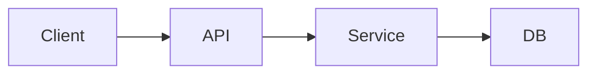

# System Patterns（架构与关键决策）

> 系统怎么搭起来的、为什么这么搭。重点是模式与决策，而非逐行实现。

## 架构总览

<用文字或 mermaid 描述主要组件与数据流>

## 关键技术决策

| 决策 | 选择 | 理由 | 关联 ADR |
|------|------|------|----------|
| <如：状态管理> | <方案> | <为什么> | `decisions/NNNN-*.md` |

## 核心设计模式 / 约定

- <如：所有错误统一为 domain error，不透传原始异常>
- <如：某层边界不可被跨越>

## 关键实现路径

- <某个核心流程从入口到落库经过哪些文件/模块>

## 已知的坑 / 约束

- <容易踩的陷阱、绝对不要做的事>
