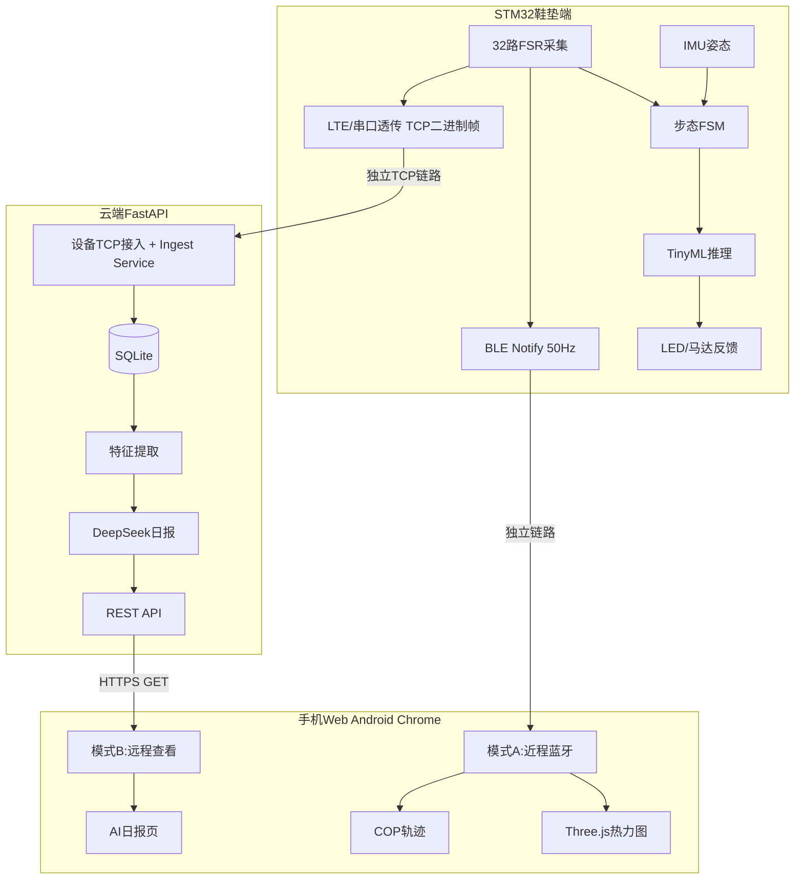

# System Patterns（架构与关键决策）

> 系统怎么搭起来的、为什么这么搭。
> 最近更新：2026-07-06

## 架构总览



**关键约束**：两条链路独立，手机不做任何数据中转（纯消费端）。

## 代码仓库结构

```
magic-insoles/
├── tools/                    独立工具集（各工具自含 README/依赖，按需运行）
│   ├── win-datacap/              开发/标定工具（Windows PC，Python）
│   │   ├── server.py                 USB-DAQ FSR TCP 服务（32路 → TCP :6543）
│   │   ├── force_server.py           Modbus 压力传感器 WebSocket（WS :8765）
│   │   ├── fsr_calibrate.py          ADC-压力标定对比 GUI（实时可视化+CSV录制）
│   │   ├── plot_fsr_grid_fit.py      批量拟合 record/*.csv → result.yml
│   │   ├── best_rx.ipynb             基于拟合模型的参考电阻(Rx)选型仿真
│   │   ├── modbus_rtu.py             Modbus RTU 帧构建/CRC
│   │   └── usb_daq_v20/              USB-DAQ Python 库
│   └── insoles-boundary/         鞋垫掩码→B-spline边界拟合工具（见其 README/docs/PIPELINE.md）
│
├── firmware/                 【硬件组负责】STM32 底层固件
│   └── 本人负责嵌入式侧数据处理+通信逻辑
│
├── backend/                  【已弃用】早期 FastAPI 测试桩（mock），见 DEPRECATED.md
│
├── backend_prod/             【权威】云端后端（Python FastAPI + SQLite + TCP ingest）
│   ├── main.py                     生产入口（uvicorn + TCP server lifecycle）
│   ├── config.py / database.py
│   ├── protocol/                   设备二进制帧解析
│   ├── services/                   ingest / feature / llm / tcp_ingest
│   ├── api/                        REST 路由
│   └── .env.example                环境变量模板（生产 .env 不提交 git）
│
├── frontend/                 【骨架完成】React + Three.js
│   └── src/
│       ├── ble/                    Web Bluetooth + frameParser
│       ├── viz/                    热力图、COP、插值
│       ├── pages/                  7 个页面（Dashboard/Activity/Gait/Gps/Report/Realtime/Balance）
│       ├── components/             布局、卡片、图表
│       ├── hooks/                  useBalanceAssessment, useMediaQuery
│       └── api/client.ts           fetch 封装
│
├── deploy/                   Nginx + systemd 模板
└── .cursor/                  数字大脑（memories/tasks/issues/skills/rules）
```

## 关键技术决策

| 决策 | 选择 | 理由 | 关联 ADR |
|------|------|------|----------|
| 数据链路 | BLE + LTE 双链路独立，手机不中转 | 近程低延迟 + 云端存储解耦；手机纯消费端 | `decisions/0001-dual-link-no-relay.md` |
| AI 体系 | TinyML 边缘 + LLM 云端 | 实时性 vs 解释性职责分离 | `decisions/0002-ai-layered-architecture.md` |
| 鉴权 | 固定 API Key（单设备） | 比赛演示从简，无用户系统 | — |
| 数据库 | SQLite | 单设备演示，无需复杂 DB | — |
| 前端路由 | `base: '/insoles/'` 子路径部署 | 与外部官网共机 ECS | — |
| 后端目录 | `backend_prod/` 唯一权威 | 弃用 `backend/` 测试桩 | `decisions/0003-backend-prod-canonical.md` |
| 热力图 | Three.js ShaderMaterial 顶点颜色 | 手机 Web 实时渲染 | — |

## 实体功能清单

### STM32 固件（本人负责的嵌入式数据处理接口）

| 模块 | 对外接口 | 说明 |
|------|----------|------|
| FSR 采集 | 32 路压力值数组（uint16），30Hz | 左脚 index 0–15，右脚 16–31 |
| IMU 采集 | 三轴加速度/角速度，200Hz | 当前采集但不发送，接口保留 |
| 步态 FSM | heel_strike/toe_off、stand/walk/run | 基于总压力+加速度阈值 |
| TinyML 推理 | 分类 0/1/2 + 置信度 | 模型待训练后部署 |
| BLE 发送 | 41 字节帧，Notify，20ms 周期 | 见 techContext.md BLE 协议 |
| LTE 上传 | TCP 二进制帧至后端，物联网模块做 UART/TCP 透传 | 与 BLE 互不阻塞 |
| LED/马达反馈 | 连续 5 帧异常才触发 | 避免误报 |

### 后端（FastAPI）

| 模块 | 接口 | 状态 |
|------|------|------|
| 数据接入 | 设备 TCP 二进制协议 + `POST /api/ingest` 调试入口 | 桩已实现，TCP 待实现 |
| 特征提取 | 内部服务 | 待实现 |
| LLM 报告 | `GET /api/report/today`、`/history`、`?period=` | 桩已实现 |
| 运动数据 | `GET /api/activity/today`、`/history` | 桩已实现 |
| 步态分析 | `GET /api/gait/summary` | 桩已实现 |
| GPS | `GET /api/gps/routes` | 桩已实现 |

### 前端页面路由

| 路由 | 页面 | PC | 手机 | BLE |
|------|------|:--:|:----:|:---:|
| `/dashboard` | 设备 Dashboard | ✅ | ✅ | 设备列表 |
| `/activity` | 运动情况 | ✅ | ✅ | — |
| `/gait` | 步态分析 | ✅ | ✅ | — |
| `/gps` | GPS 轨迹 | ✅ | ✅ | — |
| `/report` | 运动报告 | ✅ | ✅ | — |
| `/realtime` | 实时压力可视化 | — | ✅ | ✅ |
| `/balance` | 平衡能力评估 | — | ✅ | ✅ |

## 开发优先级

```
阶段 1 — 实时可视化闭环（最先做）
  ├── 前端：BLE 连接 + 热力图渲染
  └── 固件：BLE 发送压力帧

阶段 2 — 云端 AI 闭环（当前焦点）
  ├── 后端：TCP 二进制设备接入 + SQLite 存储
  ├── 后端：DeepSeek 报告生成
  └── 前端：报告页展示（骨架已完成）

阶段 3 — 完整度补充（有时间再做）
  ├── 前端：历史趋势图、高德地图适配
  ├── 固件：GPS 解析 + LTE 上传优化
  └── win-datacap：标定曲线导出
```

## 核心设计模式 / 约定

- 手机 Web 是纯消费端，不参与数据转发
- 所有 API 鉴权：`X-API-Key` Header
- 前端 COP 计算与后端 feature.py 使用相同 4×4 均匀网格占位（待 TBD-1 确认后替换）
- 错误统一处理，不透传原始异常到前端

## 已知的坑 / 约束

- **Web Bluetooth 要求 HTTPS 或 localhost**：`http://<IP>/insoles/realtime` 在真机上 BLE **不可用**，需 HTTPS 才能真机测试热力图
- **STM32 LTE 测试阶段**：使用物联网模块 TCP 透传连接后端 `DEVICE_TCP_PORT`；`POST /api/ingest` 仅作本地仿真/调试入口
- **平衡评估 BLE 命令**：Write Characteristic `0000FFF2`，命令 `0x02 0x01`（开始）/ `0x02 0x00`（停止），待硬件组确认（TBD-BLE）
- `sensorLayout.ts` 坐标为占位，待 TBD-1 确认
