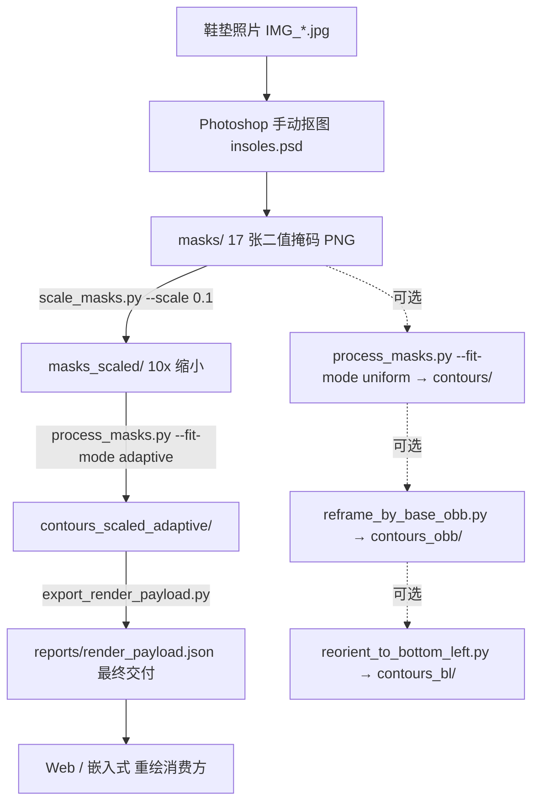

# 鞋垫 FSR 阵列边界拟合 · 处理流程与算法总览

> 本文件把散落在 `docs/memories/`、`docs/tasks/`、`docs/discussions/` 的需求、算法、命令、验收指标整合为**单一可读文档**，作为未来复用本项目的入口。
> 最初实现于独立项目 `ignored/insoles-boundary/`（含独立 git 历史）；此处为整理后的留存副本。

---

## 1. 背景与目标

有一块**不规则形状的 FSR（力敏电阻）阵列鞋垫**。为了在数字层面完整可视化它（映射传感器坐标、绘制压力热力图、标定区域），采用如下人工前处理：

1. 尽量水平地拍摄鞋垫照片；
2. 在 Photoshop 中**手动抠图**，得到鞋垫本体（base）与 16 个传感器区域，共 **17 张二值掩码**；
3. 所有掩码保持统一物理尺度 **0.00855 cm/pixel**。

**核心目标**：把这些二值掩码转换为**紧凑、连续、可参数化**的几何边界模型（周期 B-spline），而不是直接存储 mask 位图；最终产出一个**自包含的单文件 JSON**（`reports/render_payload.json`），复制它即可在网页 / 嵌入式等外部环境重绘全部 17 个区域。

设计取舍的来源讨论见 [`discussions/TALK-0002.md`](discussions/TALK-0002.md)：结论是**「等间距重采样 + 闭合 B-spline 拟合」**，明确**不使用 `approxPolyDP`**（会破坏局部曲率）。

### 范围边界

- **做**：掩码缩放、轮廓提取与参数化、拟合质量验收、导出 render payload、坐标系变换（OBB / 左下角）。
- **不做**：实时采集、固件驱动、完整 UI 产品、压力插值热力图（由消费方自行实现重绘与可视化）。

---

## 2. 物理尺度约定（重要）

| 数据集 | 线性缩放 `dimension_scale` | `pixel_scale_cm` | 说明 |
|--------|---------------------------|------------------|------|
| 原始掩码 `masks/` | 1.0 | **0.00855** | 手动抠图输出，全分辨率 |
| 缩放掩码 `masks_scaled/` | 0.1（10× 缩小） | **0.0855** | 最终 adaptive 流水线输入 |

关键公式（见 `src/insoles/schema.py::pixel_scale_for_dimension_scale`）：

```
scaled_pixel_scale_cm = source_pixel_scale_cm / dimension_scale
```

10× 缩小 → 每像素代表的物理尺寸放大 10 倍：`0.00855 / 0.1 = 0.0855`。**缩放后务必同步修正 `pixel_scale_cm`**，否则物理量会错 10 倍（这是本项目踩过的坑）。

---

## 3. 目录结构

```
tools/insoles-boundary/
├── README.md                     快速上手
├── requirements.txt              Python 依赖
├── src/insoles/                  核心算法库（纯函数为主）
│   ├── contour.py                掩码→轮廓→参数化 主流程 + 拟合选择
│   ├── uniform_bspline.py        均匀周期三次 B-spline 拟合/采样/渲染
│   ├── adaptive_bspline.py       非均匀（自适应布点）周期 B-spline
│   ├── boundary_metrics.py       对称边界距离 / Hausdorff 指标
│   ├── obb_transform.py          Base 长轴 OBB 扩边与仿射变换
│   ├── coord_transform.py        左上(x,y) ↔ 左下(row,col) 坐标变换
│   ├── render_payload.py         导出紧凑可携带 JSON 载荷
│   └── schema.py                 ContourModel / FitMetadata JSON 序列化
├── scripts/                      命令行流水线
│   ├── scale_masks.py            掩码等比缩放（最近邻，保二值）
│   ├── process_masks.py          批量拟合（uniform / adaptive）+ IOU 验收
│   ├── export_render_payload.py  导出 render_payload.json（最终交付）
│   ├── render_contour.py         单张轮廓 JSON 重绘回 mask（抽查）
│   ├── reframe_by_base_obb.py    按 base 长轴 OBB 统一重映射（可选）
│   ├── reorient_to_bottom_left.py 左下角 row/col 坐标系（可选）
│   └── summarize_scaled_pipeline.py 修正 scaled pixel_scale + 汇总对比表
├── masks/                        17 张原始掩码 PNG（手动抠图，0.00855 cm/px）
├── masks_scaled/                 17 张 10× 缩小掩码 PNG
├── contours/                     原始分辨率 uniform 轮廓 JSON
├── contours_scaled/              缩放后 uniform 轮廓 JSON
├── contours_scaled_adaptive/     缩放后 adaptive 轮廓 JSON（render payload 来源）
├── reports/                      各阶段验收报告 + 最终 render_payload.json
└── docs/
    ├── PIPELINE.md               （本文件）
    ├── memories/                 项目「数字大脑」快照（projectbrief/systemPatterns/…）
    ├── tasks/                    四个阶段的任务留痕（Problem/思路/Debug/Lessons）
    └── discussions/TALK-0002.md  与 ChatGPT 的方案讨论（设计理念来源）
```

> 说明：原项目中的 `data/` 目录经校验是 `masks/`+`contours/` 的完全重复副本，已在留存时去重跳过。

---

## 4. 完整流水线



### 前置：安装依赖

```bash
cd tools/insoles-boundary
python -m venv .venv && . .venv/Scripts/activate   # Windows PowerShell: .venv\Scripts\Activate.ps1
pip install -r requirements.txt
```

依赖：`numpy`、`opencv-python`、`scipy`、`pillow`。脚本会自动把 `src/` 加入 `sys.path`，无需安装为包。

### 阶段 0：照片 → 手动抠图 → 掩码（人工）

在 Photoshop 中对水平拍摄的照片逐区域抠图，导出 base + 1..16 共 17 张二值 PNG 到 `masks/`。这是全流程唯一的人工步骤，也是最珍贵、最难复现的输入。原始素材（PSD/照片）位置见第 8 节。

### 阶段 1（可选）：原始分辨率 uniform 参数化

```bash
python scripts/process_masks.py --fit-mode uniform \
  --mask-dir masks --output-dir contours \
  --report reports/iou_summary.json
```

在控制点预算内（传感器 10–100、base 10–150）搜索使 **IOU 最大**的均匀周期三次 B-spline。原始分辨率 mean IOU ≈ 0.992。

### 阶段 2：掩码缩放（减小数据量）

```bash
python scripts/scale_masks.py --scale 0.1 \
  --mask-dir masks --output-dir masks_scaled \
  --source-pixel-scale-cm 0.00855
```

**最近邻插值 + 重新二值化**，保持二值语义；输出报告含正确的 `pixel_scale_cm=0.0855`。

### 阶段 3：缩放掩码 → adaptive B-spline（推荐主线）

```bash
python scripts/process_masks.py --fit-mode adaptive --metric boundary_mean \
  --mask-dir masks_scaled --output-dir contours_scaled_adaptive \
  --report reports/boundary_summary_scaled.json \
  --dimension-scale 0.1 --source-pixel-scale-cm 0.00855
```

误差驱动地自适应布点（详见第 5 节），以**对称平均边界距离 `boundary_mean`** 为优化目标。scaled 数据集：mean boundary ≈ 0.35 px、mean Hausdorff ≈ 1.79 px。

### 阶段 3.5（可选）：修正尺度并生成对比表

```bash
python scripts/summarize_scaled_pipeline.py --dimension-scale 0.1
```

统一把 `contours_scaled*/` 的 `pixel_scale_cm` 修正为 0.0855，并把 uniform vs adaptive 结果汇总到 `reports/scaled_record.json`（仅供 QA 对比；外部集成请用 `render_payload.json`）。

### 阶段 4：导出最终交付物 render payload

```bash
python scripts/export_render_payload.py \
  --contour-dir contours_scaled_adaptive \
  --output reports/render_payload.json
```

产出 `reports/render_payload.json`（schema `insoles.render_payload/v1`，~8KB）：画布 132×327、`pixel_scale_cm=0.0855`、17 个区域的 `cp`+`knots`。结构与外部重绘方式见第 6 节。

### 抽查：单张轮廓重绘回 mask

```bash
python scripts/render_contour.py contours_scaled_adaptive/base.json -o /tmp/base.png
```

### 可选分支：OBB 重映射 + 左下角坐标系

```bash
# 1) 按 base 长轴 (1883,609)->(1763,3643) 计算 OBB，长/短轴各外扩 1cm，统一重映射
python scripts/reframe_by_base_obb.py --margin-cm 1.0    # → masks_obb/ contours_obb/  (mean IOU 0.9895)
# 2) 转成以图片左下角为原点、col 向上、row 向左的坐标系
python scripts/reorient_to_bottom_left.py               # → masks_bl/ contours_bl/
```

这两步用于把所有区域统一到一个与鞋垫主轴对齐的矩形画布 / 特定坐标系，尚未并入 render payload（如需可后续烘焙）。

---

## 5. 算法细节

### 5.1 轮廓提取与弧长均匀重采样

`src/insoles/contour.py`

- `load_mask`：读 PNG，取通道 `>127` 得布尔掩码。
- `extract_largest_contour`：`cv2.findContours(RETR_EXTERNAL, CHAIN_APPROX_NONE)` 取面积最大外轮廓。**用 `CHAIN_APPROX_NONE` 保留全部像素点**，不做多边形近似。
- `resample_contour`：按累计弧长把闭合轮廓**等距重采样**为 N 点（拟合目标 `FIT_TARGET_POINTS=200`）。原始点密度不均，直接拟合会偏，故必须先均匀化。

### 5.2 均匀周期三次 B-spline（uniform）

`src/insoles/uniform_bspline.py`，degree=3

- 周期性：把控制点首尾各环绕 `degree` 个（`_extended_control_points`），配合均匀 knot 向量，得到闭合曲线。
- 拟合：对 `u=i/m` 建立基函数**设计矩阵**，对 x、y 分别 `np.linalg.lstsq` 最小二乘求控制点。
- 渲染：`u∈[0,1)` 采 `eval_n`（默认 2000）点 → `cv2.fillPoly` 填充成 mask。
- 选点：`auto_select_fit` 在 `[min_cp,max_cp]` 内**粗搜（step=5）+ 局部精搜（±5）**，选 IOU 最大者；周期样条实际控制点数需按 `control_point_count` 校验。

### 5.3 自适应布点周期 B-spline（adaptive，主线）

`src/insoles/adaptive_bspline.py` + `contour.py::auto_select_fit_adaptive`

动机：uniform + IOU 在 CP 预算 20/40 下 mean IOU 仅 ~0.92，边界视觉偏差明显。改为**非均匀布点**并以边界距离为目标：

1. 从 `min_cp` 个均匀参数起步；
2. 拟合当前 knot 参数下的非均匀周期三次 B-spline（`fit_adaptive_bspline`，lstsq）；
3. 用 KD 树算 target→曲线的最近距离，找**误差最大点**，在其弧长参数处**插入新 knot**（`insert_knot_param`，带最小间距约束）；
4. 重复直到 `max_cp`；
5. 在所有候选中，按 `boundary_mean`（或 `hausdorff`）**最小**者选最终拟合。

关键实现点：
- knot 向量由弧长参数 `knot_params` 推导（`build_periodic_knots`），并做归一化 / 最小间距保护（`normalize_knot_params`）。
- **单点 worst-index 插入在 ~12 CP 后易失败**；改为在**误差最大的前 10 个候选点**里逐个尝试插入，base 才能吃满预算至 32 CP，mean boundary 从 0.40 → 0.35 px。
- 在 CP 预算内优化 `boundary_mean` 时算法倾向较少 CP（10–12），需允许多候选插入点才能用满预算。
- adaptive 的轮廓 JSON **必须带 `knot_params`**（uniform 无），否则无法重建。

### 5.4 边界距离指标

`src/insoles/boundary_metrics.py`

- 对 target 点与曲线采样点互相用 KD 树求最近距离；
- `boundary_mean = (mean(d_target→curve) + mean(d_curve→target)) / 2`（对称平均边界距离，比 IOU 更贴近视觉边界偏差）；
- `hausdorff_px = max(两向最大距离)`。
- 结论：**边界距离与 IOU 不完全一致**，验收应同时看 verification diff 图与 boundary 指标。

### 5.5 Base 长轴 OBB 扩边（可选）

`src/insoles/obb_transform.py`

- 给定长轴单位向量 `u_long` 与法向 `u_short` 建立局部坐标系；
- 用 base 采样曲线在两轴上的投影 min/max，各方向按 `margin_px = margin_cm / pixel_scale_cm` 外扩；
- 构建统一仿射 `old→new`，对 `masks/*.png` 用 `warpAffine(INTER_NEAREST)`、对控制点用矩阵变换，全量映射到 3272×1325 新画布，`pixel_scale_cm` 不变。**mask 重采样必须最近邻**，避免边界灰阶污染。

### 5.6 左下角 row/col 坐标系（可选）

`src/insoles/coord_transform.py`

- 点：`row = x`，`col = H-1-y`（原点在左下，col 向上、row 向左）；
- mask：等价于 `transpose` 再 `fliplr`；
- `image_size` 数值不变，语义变为 `[n_rows, n_cols]`，`pixel_scale_cm` 不变；
- 验证时通过往返变换接入现有渲染器。

---

## 6. render_payload.json（最终交付物 · v1）

`src/insoles/render_payload.py`，schema = `insoles.render_payload/v1`

| 字段 | 含义 |
|------|------|
| `schema` | `insoles.render_payload/v1` |
| `coordinate_system` | `origin=top_left, x=right, y=down, units=px` |
| `canvas` | `width`、`height`、`pixel_scale_cm` |
| `spline` | `type`(adaptive_bspline)、`degree`(3)、`eval_n`、`closed`(true)、`knot_field` |
| `regions[]` | `id`、`role`(base/sensor)、`cp`(控制点)、`knots`(adaptive 必需)、可选 `dup` |

**外部重绘步骤**（无需依赖本仓库）：

1. 对每个 region，在 `u∈[0,1)`（`endpoint=false`）采样 `eval_n` 个点；
2. adaptive 区域用 `cp + knots` 求周期三次 B-spline 曲线；
3. 闭合多边形 → 在 `width×height` 画布上 `fillPoly` 填充；
4. 需要物理尺寸时用 `pixel_scale_cm`（cm/px）换算。

> 待办：为外部消费方提供 `adaptive_bspline` 采样器的 JS/C 参考实现。

---

## 7. 验收指标汇总

| 阶段 / 数据集 | 方法 | 关键指标 |
|---------------|------|----------|
| 原始分辨率 | uniform + IOU | mean IOU ≈ 0.992 |
| scaled（CP 20/40） | uniform + IOU | mean IOU ≈ 0.924 |
| scaled（CP 20/40） | **adaptive + boundary_mean** | mean boundary ≈ **0.35 px**、mean Hausdorff ≈ 1.79 px、mean IOU ≈ 0.914 |
| OBB 重映射 | warpAffine + 控制点变换 | mean IOU 0.9895（min 0.9850, max 0.9981） |
| 左下角坐标 | 索引重排 + 往返验证 | mean IOU 0.9895 |

报告文件：`reports/iou_summary*.json`、`reports/boundary_summary_scaled.json`、`reports/obb_frame.json`、`reports/scaled_record.json`、`reports/render_payload.json`。

---

## 8. 原始素材位置（不入 git）

以下大体积原始素材保留在原项目的 `ignored/` 内（本地留存，不进版本库以免污染 git 历史）：

```
ignored/insoles-boundary/ignored/
├── insoles.psd                 65 MB  Photoshop 手动抠图工程（图层化，最珍贵）
├── IMG_20260705_211123.jpg      3 MB  原始鞋垫照片
├── insoles.png                  7 MB  抠图导出的合成图
├── verification*/               各阶段「原图 | 重绘 | 差异」三联对比图
└── masks_obb/ contours_obb/ …   OBB / 左下角等中间产物
```

如需重跑或复核，从 `insoles.psd` 重新导出 `masks/` 即可衔接阶段 1。

---

## 9. 已知问题 / 约束

- `1.png` 与 `2.png` 掩码完全相同（1、2 号传感器几何一致），payload 中以 `dup` 标注。
- `uniform_bspline` 旧 JSON 无 `knots`；render payload 目前仅导出 adaptive。
- `pixel_scale_cm` 随缩放变化，务必用 `pixel_scale_for_dimension_scale` 同步修正。
- 拍摄存在透视 / 旋转 / 缩放畸变；若后续要求压力显示精确到毫米，建议拍摄时加入标定板 / ArUco marker 求单应矩阵，把图像坐标校正到真实物理坐标（见 TALK-0002 第 6 节）。

---

## 10. 延伸阅读

- 设计讨论：[`discussions/TALK-0002.md`](discussions/TALK-0002.md)
- 阶段任务留痕：[`tasks/`](tasks/)（掩码参数化 / OBB 重映射 / 左下角坐标 / 自适应 B-spline）
- 项目「数字大脑」快照：[`memories/`](memories/)（projectbrief / systemPatterns / progress 等）
