# System Patterns（架构与关键决策）

> 系统怎么搭起来的、为什么这么搭。

## 架构总览

```mermaid
flowchart LR
    src[masks PNG] --> fit1[process_masks.py adaptive]
    fit1 --> contours[contours]
    src --> reframe[reframe_by_base_obb.py]
    contours --> reframe
    reframe --> masks_obb[masks_obb CW90]
    masks_obb --> scale[scale_masks.py 0.1]
    scale --> masks_scaled[masks_scaled]
    masks_scaled --> fit2[process_masks.py adaptive]
    fit2 --> contours_adaptive[contours_scaled_adaptive]
    contours_adaptive --> export[export_render_payload.py]
    export --> payload[render_payload.json]
    payload --> consumer[Web / fsr_calibrate]
```

**最终交付物**：`reports/render_payload.json`（`insoles.render_payload/v1`）

## 关键技术决策

| 决策 | 选择 | 理由 |
|------|------|------|
| 轮廓表示 | 周期三次 B-spline | 平滑、存储小、易采样成多边形 |
| 拟合模式 | `adaptive_bspline` | 误差驱动 knot 插入，同 CP 预算边界更贴 |
| 优化目标 | `boundary_mean` | 比 IOU 更贴近视觉边界偏差 |
| OBB 后处理 | 默认 `--rotate-cw90` | 竖版画布（1318×3244），便于下游显示 |
| 缩放策略 | 10× 缩小 + 最近邻 | 减小数据量；`pixel_scale_cm` 同比放大 |
| 外部交换格式 | 单文件 render payload | 复制即用，不依赖仓库内多目录 JSON |

## render_payload 结构（v1）

| 字段 | 含义 |
|------|------|
| `schema` | `insoles.render_payload/v1` |
| `coordinate_system` | 左上原点，x 右、y 下，单位 px |
| `canvas` | `width`, `height`, `pixel_scale_cm` |
| `spline` | `type`, `degree`, `eval_n`, `closed` |
| `regions[]` | `id`, `role`, `cp`, `knots`（adaptive 必需）, 可选 `dup` |

重绘步骤：对每个 region 在 `u∈[0,1)` 采样 `eval_n` 点 → 闭合多边形 → `fillPoly`。

## 关键实现路径

- 拟合：`src/insoles/contour.py` → `mask_to_parametric_contour(fit_mode=adaptive)`
- 样条：`src/insoles/adaptive_bspline.py`
- OBB 旋转：`src/insoles/obb_transform.py` → `rotate_image_90_clockwise` / `rotate_points_90_clockwise`
- 导出与运行时渲染：`src/insoles/render_payload.py` + `scripts/export_render_payload.py`
- 验收：`reports/boundary_summary_scaled.json`

## 已知的坑 / 约束

- `pixel_scale_cm` 随缩放变化：`scaled = source / dimension_scale`（10× 缩小 → 0.0855）
- `uniform_bspline` 旧 JSON 无 `knots`；render payload 当前仅导出 adaptive
- OBB 裁切后默认 **顺时针旋转 90°**（`--rotate-cw90`，`obb_transform.rotate_*`）
- 源掩码修正历史保留在 `ignored/insoles-boundary/ignored/`（PSD/照片）；`tools/` 内 `masks/` 为可复现副本
