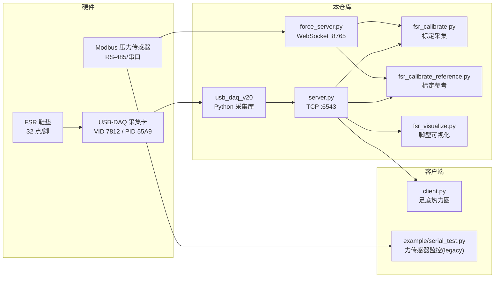

# win-datacap

足底 FSR（力敏电阻）与参考压力传感器的数据采集、可视化与标定工具集。

本仓库面向 **magic-insoles** 足底传感系统：通过 USB-DAQ 采集卡读取鞋垫上的 32 路 FSR 电压，通过 Modbus RTU 串口读取高精度压力传感器作为标定参考，并提供 TCP / WebSocket 数据发布与图形界面。

---

## 系统概览



| 组件 | 通信方式 | 数据内容 |
|------|----------|----------|
| USB-DAQ + FSR | USB bulk（`usb_daq_v20`） | 32 路 ADC 电压（0~3.3 V） |
| `server.py` | TCP `127.0.0.1:6543` | 320 字节/帧：32 传感器 + 时间戳 |
| Modbus 压力传感器 | 串口 RTU | 6 路 float + 状态寄存器 |
| `force_server.py` | WebSocket `ws://127.0.0.1:8765` | JSON 广播力值 |

---

## 仓库结构

```
win-datacap/
├── usb_daq_v20/          # Python USB-DAQ 库（CardID 索引、完整 API）
│   ├── README.md         # 库文档：安装、各平台驱动、API 参考
│   └── example/          # 示例脚本
├── fsr_server.py         # FSR 数据采集 TCP 服务（同 README 中的 server.py）
├── force_server.py       # Modbus 压力传感器 WebSocket 服务
├── fsr_calibrate.py      # 标定采集：ADC 折线 + CSV 录制
├── fsr_calibrate_reference.py  # 标定参考：同轴压力 0–300 N + 残差
├── fsr_visualize.py      # 脚型可视化：热力图 + COP
├── fsr_calibrate/        # 标定模块（三个 UI + IO / pipeline / heatmap）
├── plot_fsr_grid_fit.py  # 批量拟合 record/*.csv → result.yml + fsr_fit.png
├── best_rx.ipynb         # 基于拟合模型的参考电阻(Rx)选型仿真
├── record/<批次>/        # 标定原始 CSV + 拟合产物（result.yml / fsr_fit.png）
├── docs/CALIBRATION_PIPELINE.md  # 标定/拟合/Rx选型全流程说明
├── example/              # 历史 sample 脚本（非主流程）
│   ├── plot_fsr_fit.py   # 旧版单通道拟合示例
│   └── serial_test.py    # 旧版串口监控示例
├── serial_test.py        # Deprecated 包装入口，转发到 example/serial_test.py
├── plot_fsr_fit.py       # Deprecated 包装入口，转发到 example/plot_fsr_fit.py
├── modbus_rtu.py         # Modbus RTU 帧构建 / CRC 校验
├── requirements.txt      # 基础依赖
└── bak/                  # 历史 C++ 实现与旧版 client.py
```

---

## 环境安装

### 1. Python 环境

推荐 Python 3.10+，在项目根目录执行：

```bash
pip install -r requirements.txt
```

基础依赖（`requirements.txt`）：

| 包 | 用途 |
|---|---|
| `pyusb` | USB-DAQ 访问 |
| `libusb-package` | libusb 动态库 |

### 2. 按功能额外安装

| 功能 | 额外依赖 |
|------|----------|
| FSR 标定 UI | `numpy`, `pyqtgraph`, `websockets` |
| 足底热力图客户端 | `numpy`, `opencv-python`, `PyQt5`, `matplotlib`（见 `bak/client.py`） |
| 力传感器监控 | `numpy`, `pyserial`, `pyqtgraph` |

一次性安装示例：

```bash
pip install pyusb libusb-package numpy pyserial pyqtgraph websockets
# 若使用 client 可视化：
pip install opencv-python PyQt5 matplotlib
```

### 3. USB-DAQ 驱动

**Windows** 需用 [Zadig](https://zadig.akeo.ie/) 将采集卡绑定为 **WinUSB**。  
**Linux / macOS** 需配置 udev 或系统 libusb，详见 [usb_daq_v20/README.md](usb_daq_v20/README.md#各平台连接说明)。

验证采集卡连接：

```bash
python -m usb_daq_v20
```

---

## 使用方法

### A. USB-DAQ 库（底层）

完整 API、多平台说明与示例见 **[usb_daq_v20/README.md](usb_daq_v20/README.md)**。

```python
import usb_daq_v20

devices = usb_daq_v20.open_all()
card_id = devices[0].card_id
v = usb_daq_v20.ad_single(card_id, chan=0)
usb_daq_v20.close_all()
```

多卡时通过环境变量或 CardID 指定设备（`server.py` 同样支持）：

```bash
set DAQ_CARD_ID=0x00BC614E    # Windows
export DAQ_CARD_ID=0x00BC614E # Linux / macOS
```

---

### B. FSR 实时采集（TCP 服务）

从 USB-DAQ 扫描 32 路 FSR，经 TCP 向外推送。

```bash
python fsr_server.py
```

- 监听：`127.0.0.1:6543`
- 每帧 **320 字节**（40 个 native-endian `double`）：
  - `[0..31]` — 32 路传感器电压
  - `[32]` — 时间戳（秒）
  - `[33..39]` — 保留零

指定采集卡（可选）：

```bash
set DAQ_CARD_ID=0x12345678
python fsr_server.py
```

#### 从 CSV 回放（无需 USB-DAQ）

将标定采集录制的 CSV（`timestamp, fsr_00..fsr_31, ...`）按原 TCP 协议回放，供 `fsr_visualize.py` 等下游 GUI 离线调试：

```bash
# 按 CSV 原始时间间隔回放
python fsr_server.py --playback record/9mm/20260706_212154.csv

# 2 倍速
python fsr_server.py --playback record/9mm/20260706_212154.csv --speed 2

# 尽快推送（不 sleep，便于快速浏览）
python fsr_server.py --playback record/9mm/20260706_212154.csv --fast

# 循环播放
python fsr_server.py --playback record/9mm/20260706_212154.csv --loop
```

与脚型可视化联调：

```bash
# 终端 1 — CSV 回放
python fsr_server.py --playback record/9mm/20260706_212154.csv --fast

# 终端 2 — 热力图
python fsr_visualize.py
```

回放时 TCP 帧内时间戳取自 CSV 的 `timestamp` 列（非 `time.time()`）。**限制**：仅回放 FSR；标定采集/参考 UI 的参考压力仍依赖 `force_server.py`，不能仅凭 FSR 回放完整复现双轴标定场景。

---

### C. 足底热力图可视化

`bak/client.py` 连接 `server.py`，将 32 路数据渲染为左右脚热力图（PyQt5 + matplotlib）。

```bash
# 终端 1
python server.py

# 终端 2
python bak/client.py
```

---

### D. 压力传感器（Modbus）

**独立监控**（单进程，直连串口）：

```bash
# legacy sample：默认 COM4 @ 9600，可在 example/serial_test.py 顶部修改
python example/serial_test.py
```

**WebSocket 发布**（供标定等多客户端订阅）：

```bash
# 修改 force_server.py 中 PORT = "COM4" 等配置
python force_server.py
```

- 监听：`ws://127.0.0.1:8765`
- JSON 帧含 `values`（6 通道 float）、`timestamp`、`status`

---

### E. FSR 标定与可视化

三个独立 UI，按需启动（均需先运行 `fsr_server.py`；标定采集与标定参考还需 `force_server.py`）：

| 脚本 | 用途 | 依赖服务 |
|------|------|----------|
| `fsr_calibrate.py` | 标定采集：双 Y 轴 ADC vs 参考压力折线 + CSV 录制 | FSR TCP + 压力 WS |
| `fsr_calibrate_reference.py` | 标定参考：同轴压力对比（Y 固定 0–300 N）+ 残差曲线 | FSR TCP + 压力 WS + `result.yml` |
| `fsr_visualize.py` | 脚型可视化：ADC/压力热力图 + 重心 (COP) | FSR TCP + `result.yml`（压力模式） |

```bash
# 终端 1 — FSR 数据源
python fsr_server.py

# 终端 2 — 压力 WebSocket 源（标定采集 / 标定参考需要）
python force_server.py

# 终端 3 — 按需选一个 UI
python fsr_calibrate.py              # 标定采集
python fsr_calibrate_reference.py    # 标定结果参考
python fsr_visualize.py            # 脚型可视化
```

标定采集界面：FSR 通道下拉、双 Y 轴实时曲线、开始/停止录制（`record/*.csv`）。

**嵌入式 COP 质心表**：boundary 几何导出为 C 头文件，供 STM32 快速计算重心/轨迹：

```bash
# 从 insoles-boundary render_payload 同步 JSON + C 质心表
python ../../scripts/export_boundary_assets.py
```

产物见 `generated/insole_sensor_centroids.h`、`generated/insole_cop.h`；算法说明见 **[docs/COP_EMBEDDED.md](docs/COP_EMBEDDED.md)**。

---

### F. 离线拟合与参考电阻（Rx）选型

标定 UI 录制的 CSV（`record/<批次>/*.csv`）需要离线批量拟合，导出可被实时界面复用的 `result.yml`；`best_rx.ipynb` 则基于拟合结果反过来评估/选型分压电阻。完整流程、公式与算法细节见 **[docs/CALIBRATION_PIPELINE.md](docs/CALIBRATION_PIPELINE.md)**。

```bash
# 批量拟合 record/9mm 下全部 CSV，导出 result.yml + fsr_fit.png
python plot_fsr_grid_fit.py --record-dir record/9mm

# 基于 result.yml 中的幂函数拟合参数，仿真不同 Rx 下的 12-bit ADC 量化误差
jupyter notebook best_rx.ipynb
```

---

## 典型工作流

### 日常采集 + 可视化

```
1. python -m usb_daq_v20          # 确认采集卡 CardID
2. python server.py               # 启动 FSR 服务
3. python bak/client.py           # 打开热力图
```

### FSR 标定

```
1. 将 Modbus 压力传感器与待标定 FSR 点同步施压
2. 启动 fsr_server.py + force_server.py + fsr_calibrate.py
3. 在 UI 中选择对应 FSR 通道，录制 ADC–压力 CSV
4. plot_fsr_grid_fit.py 拟合 → result.yml
5. fsr_calibrate_reference.py 验证拟合精度；fsr_visualize.py 查看脚型压力/COP
```

---

## 配置速查

| 脚本 | 可配置项 | 默认值 |
|------|----------|--------|
| `server.py` | `HOST`, `PORT`, 环境变量 `DAQ_CARD_ID` | `127.0.0.1:6543` |
| `force_server.py` | `PORT`, `BAUDRATE`, `SLAVE_ADDR` | `COM4`, 9600, `0x01` |
| `example/serial_test.py` | 同上 | 同上 |
| `fsr_calibrate/config.py` | `FSR_HOST/PORT`, `FORCE_WS_URL` | TCP `:6543`, WS `:8765` |

Modbus 寄存器布局与 `example/serial_test.py` / `force_server.py` 一致：读 13 个保持寄存器，解析 6 路 big-endian float。

---

## Legacy Samples

- `example/plot_fsr_fit.py` 与 `example/serial_test.py` 为历史样例，不再作为主流程工具。
- 根目录同名脚本保留为兼容包装入口，后续建议直接使用 `example/` 下路径。

---

## 故障排查

| 现象 | 可能原因 | 处理 |
|------|----------|------|
| `usb device open fail` | USB 驱动/权限 | 见 [usb_daq_v20/README.md](usb_daq_v20/README.md) |
| `CLAIM_FAILED` / `BUSY` | 设备被占用 | 关闭其他 `server.py` 实例 |
| TCP 连接失败 | 服务未启动 | 先运行 `server.py` |
| 标定界面无压力数据 | WebSocket 未连 | 先运行 `force_server.py`，检查 COM 口 |
| 串口打开失败 | COM 口错误或占用 | 修改 `PORT`，关闭串口调试工具 |

库内错误会抛出 `DaqError`，包含阶段、libusb 错误码与中文说明，例如：

```
[DaqError CLAIM_FAILED] stage=claim bus=1 addr=5: claim_interface 失败...
```

---

## 历史代码（`bak/`）

旧版 **C++ TCP 服务**、原生 `usb-daq-v20` 库、PyQt 客户端及 ROS 双足示例。第三方依赖 Asio / libusb 已从仓库移除，**C++ 版现无法直接编译**，详见 **[bak/README.md](bak/README.md)**。

| 文件 | 说明 |
|------|------|
| `server.cpp` + `usb-daq-v20.cpp` | 原版 C++ TCP 服务与 USB 库 |
| `client.py` | 足底热力图 PyQt 客户端（仍可用于 `server.py`） |
| `bak/bak/get_two_plantar*.cpp` | 双足 ROS / socket 采集示例 |

当前推荐使用 Python 路径：`usb_daq_v20` + `server.py`。

---

## 相关文档

- [usb_daq_v20/README.md](usb_daq_v20/README.md) — 采集库 API、Linux/macOS/Windows 驱动、示例脚本
- [docs/CALIBRATION_PIPELINE.md](docs/CALIBRATION_PIPELINE.md) — FSR 标定、离线拟合与参考电阻（Rx）选型全流程
