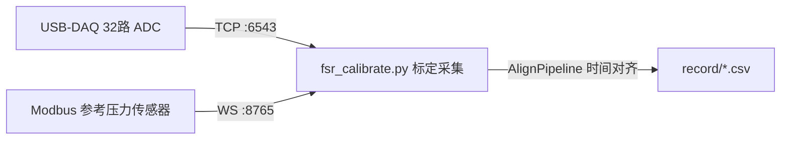

# FSR 标定、拟合与参考电阻（Rx）选型

> 把 `win-datacap` 中「采集 → 标定 → 拟合 → 参数复用 → 硬件参数反选」这条完整链路串起来，重点补充 `best_rx.ipynb` 的用途与方法。工具/脚本本身的运行方式见上级 [`README.md`](../README.md)。

## 1. 硬件模型：FSR 分压电路

```
Vcc(3.3V) ── FSR(R) ──┬── R_fixed(固定电阻) ── GND
                       │
                      ADC 采样节点 V
```

- ADC 采的是 `R_fixed` 两端对地电压 `V`；12-bit ADC：`V = raw × (3.3 / 4096)`（`usb_daq_v20/constants.py: AD_VOLTAGE_SCALE`）。
- 由分压关系反算 FSR 阻值：

```
R_fsr = R_fixed * (Vcc - V) / V
```

（`plot_fsr_grid_fit.py::voltage_to_fsr_resistance`、`fsr_calibrate/calibration_store.py::voltage_to_resistance` 两处实现一致）

- FSR 的阻值随压力增大而减小，典型可用**指数 / 幂函数 / 倒数**三种模型近似 `R(F)`。

## 2. 数据采集（在线，`fsr_calibrate/app_capture.py`）



- `fsr_calibrate/pipeline.py::AlignPipeline` 用参考力传感器的时间戳做**插值锚点**，只在 FSR 采样时间落在参考力有效窗口内（`FORCE_ANCHOR_WINDOW_S`/`FORCE_INTERP_MAX_SKEW_S`）时才写入一行 CSV，保证 FSR 电压与参考压力**时间对齐**。
- 每行 CSV：`timestamp, fsr_00..fsr_31, force_ch0`（`_csv_header`）。
- 操作流程：对准某一路 FSR 施加连续变化的压力，同时用参考力传感器读数标定，在 `record/` 下按时间戳生成 CSV。
- 脚型热力图几何来自 `tools/insoles-boundary/reports/render_payload.json`（由 `fsr_visualize.py` 使用）。

## 3. 离线拟合（`plot_fsr_grid_fit.py`）

```bash
python plot_fsr_grid_fit.py --record-dir record/9mm
```

对 `record/<批次>/` 下**每个 CSV 独立处理**：

1. **自动选通道**：在有效压力区间内，选电压变化幅值（max-min）最大的 FSR 通道作为该次标定的对象（`select_active_fsr_channel`）。
2. **筛选动态样本**：用 `|dF/dt|` 滑动均值衡量施力变化剧烈程度，只保留高于给定百分位（默认中位数）的采样点，剔除长时间静置的样本（`select_dynamic_force_samples`）。
3. **压力分箱聚合**：按 `force_bin_n`（默认 0.5N）分箱，箱内取中位数，降低噪声（`aggregate_by_force_bins`）。
4. **三模型拟合**（`scipy.optimize.curve_fit`，`fit_three_models`）：
   - 指数：`R = a * exp(b * F)`
   - 幂函数：`R = a * F^b`
   - 倒数：`R = a / F + c`
5. 输出：
   - `record/<批次>/fsr_fit.png` — 4 列网格图，每格一路通道的散点 + 三条拟合曲线 + R²
   - `record/<批次>/result.yml` — 逐通道三模型的 `params`/`formula`/`r2`（供程序化复用）

## 4. 标定结果复用（`fsr_calibrate/calibration_store.py`）

加载 `result.yml`（默认 `record/9mm/result.yml`，见 `config.py::DEFAULT_CALIB_YAML`）后，对每路 FSR：`电压 → 电阻（分压公式）→ 力（选定模型的反函数）`。

| UI 入口 | 模块 | 功能 |
|---------|------|------|
| `fsr_calibrate_reference.py` | `app_reference.py` | 单路 FSR 估算压力 vs 参考压力（同轴 0–300 N）+ 残差曲线 |
| `fsr_visualize.py` | `app_visualize.py` | 32 路热力图（ADC 或压力）+ 重心 (COP) |

## 5. 参考电阻（Rx）选型分析（`best_rx.ipynb`）

**动机**：`R_fixed`（Rx）的选择直接决定分压电压 `V` 在整个受力区间内的分布范围与 12-bit ADC 量化精度——Rx 太小或太大都会让某一端的力值区间挤在很窄的 ADC 计数范围内，量化误差被放大。`best_rx.ipynb` 用已标定的 **幂函数模型**（`R = K · F^-α`，例如 `record/9mm/result.yml` 中 `K≈1.26e6, α≈0.807`）做仿真，反过来推荐更合理的 Rx。

**方法**（notebook 4 个 cell 的流程）：

1. 取标定得到的 `R(F) = K·F^-α`，对全量程 `F ∈ [0.1N, 300N]`（步进 0.1N）正向算出理想分压电压 `V_ideal = Vcc · Rx / (R(F) + Rx)`；
2. 按 12-bit ADC 规则量化：`adc_raw = round(V_ideal / (Vcc/4096))`，再还原 `V_from_adc = adc_raw · (Vcc/4096)`（模拟真实采集卡的离散化误差）；
3. 反向重建：`R_from_adc = Rx · (Vcc - V_from_adc) / V_from_adc` → `F_from_adc = (K / R_from_adc)^(1/α)`；
4. 对比 `F`（真实施力）与 `F_from_adc`（量化后重建的力），画出 round-trip 曲线与相对误差百分比，评估该 Rx 在全量程上的力值分辨能力。

**用法**：在 notebook 顶部修改 `RX` 常量（当前默认示例 `100_000.0`Ω）与 `K`/`ALPHA`（来自 `result.yml` 某通道的 `power` 拟合结果），重新运行即可得到该 Rx 下的量化误差曲线；对比多组 Rx 取误差最小且全程较均衡的取值，作为下一版硬件分压电阻的选型依据。

> 待办：目前仍是手工改常量重跑；可扩展为对多个候选 Rx 网格搜索、自动输出「最优 Rx vs 最大相对误差」表格。

## 6. 文件速查

| 文件 | 角色 |
|------|------|
| `usb_daq_v20/` | USB-DAQ 采集库（ADC 原始电压读取） |
| `fsr_server.py` | FSR 32 路电压 TCP 服务 `:6543` |
| `force_server.py` / `modbus_rtu.py` | 参考压力传感器 Modbus → WebSocket `:8765` |
| `fsr_calibrate.py` | 标定采集 UI（ADC 折线 + CSV 录制） |
| `fsr_calibrate_reference.py` | 标定参考 UI（同轴压力 + 残差） |
| `fsr_visualize.py` | 脚型可视化 UI（热力图 + COP） |
| `record/<批次>/*.csv` | 原始标定采样（FSR 32 路电压 + 参考力，逐行对齐） |
| `plot_fsr_grid_fit.py` | 批量拟合 CSV → `result.yml` + `fsr_fit.png` |
| `best_rx.ipynb` | 基于拟合模型的 Rx（固定分压电阻）选型仿真 |
| `example/`、`bak/` | 历史 / 备用实现，非主流程（见上级 README） |
