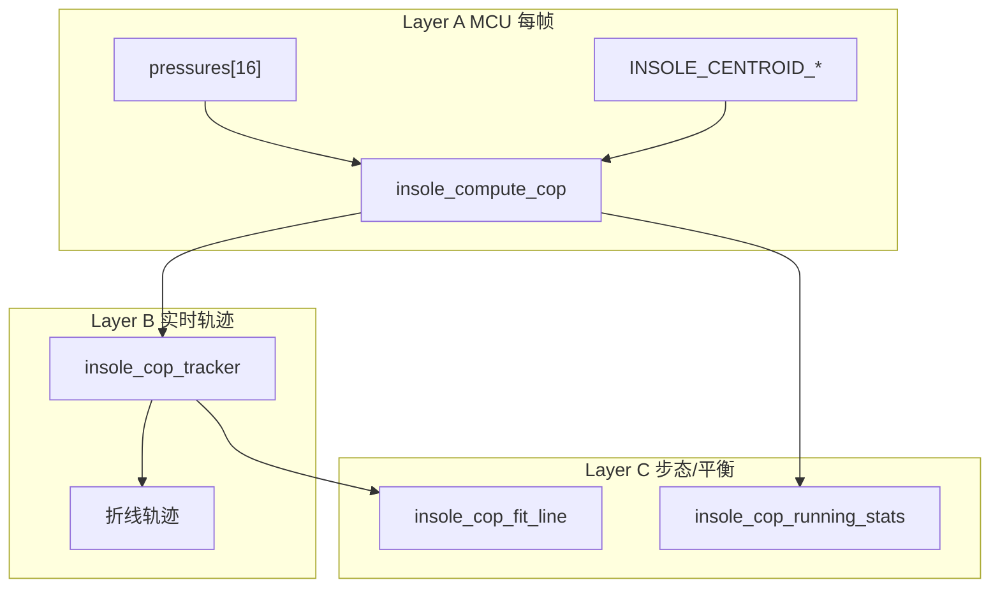

# 嵌入式重心（COP）与轨迹计算

> 与 Python [`fsr_calibrate/cop.py`](../fsr_calibrate/cop.py)、前端 [`frontend/src/viz/cop.ts`](../../../frontend/src/viz/cop.ts)、后端 [`backend_prod/services/feature.py`](../../../backend_prod/services/feature.py) 对齐。  
> 质心常量由 `tools/scripts/export_boundary_assets.py` 从 `insoles-boundary` 的 B-spline 区域多边形导出。

## 1. 传感器质心来源

每个 FSR 标点（region id = fsr_index + 1）的中心由 boundary pipeline 计算：

1. 对 adaptive B-spline 区域采样闭合多边形；
2. `cv2.fillPoly` 得到二值掩码；
3. `cv2.moments` 求几何质心 `(cx, cy)`（列/行，左上角原点）。

画布尺寸：**132 × 324**（宽 × 高）。

### 导出产物

| 文件 | 用途 |
|------|------|
| `generated/insole_sensor_centroids.h` | STM32 可直接 `#include` 的 float32 质心表 |
| `generated/insole_cop.h` / `insole_cop.c` | 单帧 COP、轨迹缓冲、线拟合参考实现 |
| `frontend/public/data/boundary_assets.json` | Web/后端消费（含 RLE masks） |

重导命令：

```bash
python tools/scripts/export_boundary_assets.py
```

boundary 几何变更后（`tools/insoles-boundary` 重跑 `process_masks.py`）必须重新执行上述命令。

## 2. 坐标约定

| 脚 | plot X | plot Y | C 常量表 |
|----|--------|--------|----------|
| 右脚 | `cx` | `cy` | `INSOLE_CENTROID_RIGHT` |
| 左脚 | `canvas_width - 1 - cx` | `cy` | `INSOLE_CENTROID_LEFT`（导出时已预镜像） |

与 ADR-0004、前端 `copToDisplayCoords` 一致。  
权重 `w[i]` 为任意非负标量：ADC 原始值、标定后压力（N）、或 BLE 归一化 0–255。

## 3. 算法分层



### Layer A — 单帧瞬时 COP（MCU 必做）

对单脚 16 路压力做加权质心：

```
sum_x = Σ w[i] * cx[i]
sum_y = Σ w[i] * cy[i]
total = Σ w[i]

if total > 0:
    cop_x = sum_x / total
    cop_y = sum_y / total
else:
    cop_x, cop_y = NaN（C 中用 INSOLE_COP_NAN = -1）
```

32 路固件数组约定：

- `pressures[0..15]` → 左脚，使用 `INSOLE_CENTROID_LEFT`
- `pressures[16..31]` → 右脚，使用 `INSOLE_CENTROID_RIGHT`

C 调用示例：

```c
#include "insole_cop.h"

uint16_t left_pressures[16];
insole_cop_t left_cop;

insole_compute_cop(left_pressures, INSOLE_CENTROID_LEFT, &left_cop);
if (left_cop.total > 0.0f) {
    /* use left_cop.x, left_cop.y */
}
```

复杂度：O(16)，约 32 次乘加，适合 50Hz 实时循环。

### Layer B — 重心轨迹（MCU 或主机）

滑动时间窗内记录 `(timestamp_ms, x, y)`：

- 默认窗口：**10 s**（`INSOLE_COP_TRAJECTORY_DEFAULT_WINDOW_MS`）
- 缓冲容量：建议 **500** 点（50Hz × 10s）
- `append` 后按 `stamp - window_ms` 裁剪旧样本
- 折线：缓冲内有效点顺序连线（对齐 `fsr_visualize` trail）

```c
insole_cop_sample_t buffer[500];
insole_cop_tracker_t tracker;

insole_cop_tracker_init(&tracker, buffer, 500, 10000);
insole_cop_tracker_append(&tracker, stamp_ms, left_cop.x, left_cop.y);
```

固件可在 BLE 帧中只上传瞬时 COP（2×float + 时间戳），由手机/云端维护轨迹；或在 MCU 上维护窗口用于平衡页本地反馈。

### Layer C — 步态/平衡分析（建议主机或高性能 MCU）

#### 主方向线拟合

对窗口内 COP 点：

1. 求质心 `(mean_x, mean_y)`；
2. 构建 2×2 协方差 `[[sxx, sxy], [sxy, syy]]`；
3. 求最大特征值对应特征向量 `(dx, dy)`，若 `dy < 0` 则翻转使主方向朝 +Y；
4. `angle_deg = atan2(|dx|, |dy|) * 180/π`（相对趾→跟 +Y 轴）。

线段端点：将各点投影到主方向 `t = (p - centroid) · direction`，取 `t_min/t_max` 得到两端点（`insole_cop_fit_line_segment`）。

与 Python `fit_cop_trajectory_line` / 前端 `fitCopTrajectoryLine` 数值一致（2×2 解析特征向量 ≡ 2D SVD 主方向）。

#### 平衡摇摆指标

对评估窗口内全部有效 COP 点（可双脚合并）：

```
std_x = sqrt(Σ (x - mean_x)² / N)
std_y = sqrt(Σ (y - mean_y)² / N)
cop_std = hypot(std_x, std_y)
sway_area = π * (2*std_x) * (2*std_y)
```

在线实现可用 `insole_cop_running_stats_push`（Welford 算法，O(1)/帧）。

平衡分（前端参考）：

```
raw_score = 100 - (sway_area * 0.05 + cop_std * 0.2)
score = clamp(raw_score, 0, 100)
```

实时偏移提示（归一化坐标）：相对窗口均值，`|avg_x| > 0.15` 或 `|avg_y| > 0.15` 时提示偏左/偏右/偏前/偏后。

## 4. 与 BLE / TCP 数据对应

### BLE 压力帧（41 字节，50Hz）

| 偏移 | 字段 | COP 用法 |
|------|------|----------|
| 3–34 | `pressure[32]` uint8 0–255 | 左脚 `[0..15]`、右脚 `[16..31]` 作权重 |
| — | 无时间戳字段 | 用本地 `millis()` 或帧序号推算 `stamp_ms` |

权重可直接用 uint8 值（比例正确即可）；若需物理压力，先在 MCU 用 `result.yml` 标定曲线转换。

### 设备 TCP Force 批（30Hz）

每批 30 个样本，每样本 32×uint16 ADC/压力。对每样本调用 Layer A；全天轨迹在云端 `backend_prod/services/feature.py::compute_cop_points` 聚合。

## 5. 回归用例

| 场景 | 期望 |
|------|------|
| 仅 `pressures[k] > 0`，其余为 0 | COP == `INSOLE_CENTROID_*[k]` |
| 两路等压 `w[0]=w[1]` | COP == 两质心坐标平均 |
| 全零压力 | `total == 0`，`x/y` 为 NaN |
| 竖直轨迹 (+Y) | `angle_deg ≈ 0°` |
| 水平轨迹 (+X) | `angle_deg ≈ 90°` |
| 对角轨迹 | `angle_deg ≈ 45°` |

Python 对照测试：`fsr_calibrate/test_cop.py`、`fsr_calibrate/test_centroids_export.py`。

## 6. 固件集成清单

1. 拷贝 `generated/insole_sensor_centroids.h`、`insole_cop.h`、`insole_cop.c` 到 STM32 工程；
2. 编译时链接 `libm`（`sqrtf`、`atan2f`、`hypotf`）；
3. 每帧读取 32 路压力 → 双脚各调 `insole_compute_cop`；
4. 按需启用 `insole_cop_tracker`（平衡页 / 步态预览）；
5. boundary 变更后重新运行 `export_boundary_assets.py` 并更新头文件。
